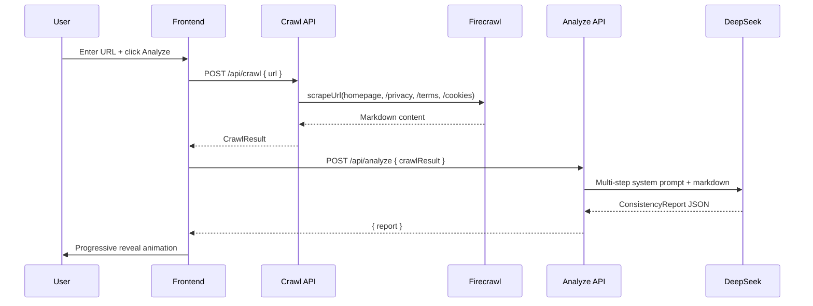
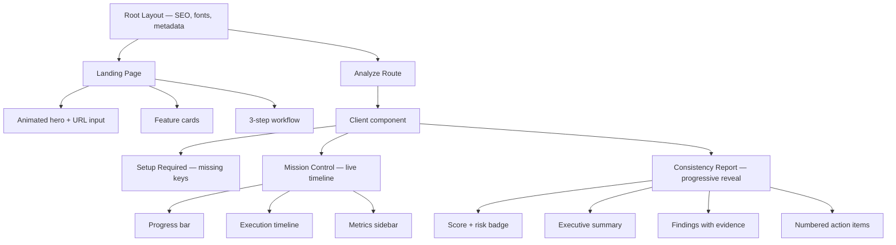

# PolicyLens — Portfolio Document

> A full-stack AI application that analyzes website vs. policy documentation consistency.
>
> **Role:** Sole Developer & Architect
> **Timeline:** July 2026
> **Stack:** Next.js 16, TypeScript, Tailwind CSS v4, Firecrawl, DeepSeek AI

---

## Problem

Companies ship features faster than their legal teams can update documentation. Common examples:

- Analytics scripts (Google Analytics, Meta Pixel) running without privacy policy disclosure
- AI chatbots collecting user data without terms of service updates
- Payment processors (Stripe, PayPal) integrated without policy mention
- Newsletter signups processing personal data without proper consent language

This "documentation drift" creates legal risk under GDPR, CCPA, and similar regulations. Traditional compliance audits are expensive ($5K–$20K per engagement), slow (weeks), and rarely run continuously.

## Solution

PolicyLens automates this audit. Enter any URL, and within 10–30 seconds you get a structured consistency report showing every gap between what the website implements and what its legal documents disclose.

## Motivation

I built PolicyLens to solve a problem I encountered while building other projects: keeping legal documentation in sync with rapidly evolving features is genuinely hard — and existing tooling is either enterprise-priced or doesn't exist. This project demonstrates that AI-assisted compliance analysis is accessible to any team with API keys and a few seconds of patience.

---

## Architecture

### High-Level Design

```
User → Next.js Frontend → POST /api/crawl → Firecrawl → Raw Markdown
                        → POST /api/analyze → DeepSeek → Structured JSON Report
```

The application follows a deliberate **server-centric architecture**:

1. **Client** (React, Tailwind, Framer Motion) — Renders UI, handles user interaction, manages local state
2. **API Routes** (Next.js serverless functions) — All external service calls execute here
3. **External Services** (Firecrawl, DeepSeek) — Accessed exclusively from server-side code

This ensures API keys are never exposed to the browser — a critical security consideration for a tool that processes potentially sensitive data.

### Request Lifecycle



### Component Architecture



---

## Engineering Challenges

### 1. AI Prompt Engineering for Structured Output

The core challenge: getting a language model to return reliably structured JSON for any website's content. The AI must extract facts, compare two separate fact sets, detect inconsistencies, assign severity, calculate a score, and produce a human-readable summary — all in one API call.

**Solution:** A comprehensive system prompt with:

- **Explicit step-by-step instructions** — Enumerates each reasoning stage (extract → compare → detect → score)
- **JSON schema definitions** — Exact field names, types, and constraints
- **Temperature 0.2** — Ensures deterministic, consistent outputs
- **Format constraints** — Forbids markdown, code blocks, or explanatory text
- **Fallback JSON parser** — Regex-based extraction if the AI wraps the response in markdown fences

```typescript
// Key prompt architecture: one call, multiple reasoning steps
const systemPrompt = `
You are analyzing a website against its legal documents.
Step 1: Extract structured WebsiteFacts from homepage content.
Step 2: Extract structured PolicyFacts from legal documents.
Step 3: Compare the fact sets (never raw text).
Step 4: Detect inconsistencies with severity and confidence.
Step 5: Calculate overall score and generate a summary.

Return ONLY valid JSON matching this schema: [schema definition]
`;
```

**Tradeoff:** Single-call design is efficient but limits debuggability — if the output format is wrong, we don't know which step failed. The fallback parser mitigates this.

### 2. Real-Time Progress Without WebSockets

The crawl + analysis pipeline takes 10–30 seconds. Without progress feedback, users perceive the app as frozen. However, adding WebSockets or Server-Sent Events would add infrastructure complexity.

**Solution:** A simulated progress system using client-side timers and state machines:

- **Phase 1: Crawl** — Deterministic steps (4 pages), each with estimated durations
- **Phase 2: Analysis** — "Thinking" messages cycled every ~2 seconds to indicate activity
- **Sidebar metrics** — Real-time counters for pages, characters, tokens
- **Progress bar** — Smooth animation proportional to estimated completion

```typescript
// Each pipeline stage has known duration estimates
const STAGE_DURATIONS = {
  homepage: 2500,
  privacy: 1500,
  terms: 1200,
  cookies: 1000,
  extracting: 3000,
  comparing: 2000,
  analyzing: 4000,
  report: 1500,
};
```

**Tradeoff:** The progress is estimated, not actual. If a crawl finishes faster than expected, the UI will "catch up" by skipping remaining animation frames.

### 3. Firecrawl Response Variance

Firecrawl returns markdown content in wildly varying formats depending on the target website. Some sites return clean, structured markdown; others return minimal content or very large documents.

**Solution:** Multi-layered content handling:

```typescript
// Content validation pipeline
const content = response.data?.content || "";
if (content.trim().length < 50) {
  document.found = false;
  document.content = null;
}
if (estimateTokens(content) > MAX_TOKENS) {
  content = truncateToTokens(content, MAX_TOKENS);
}
```

Firecrawl's `scrapeUrl()` is called with `formats: ["markdown"]` and `onlyMainContent: true` to get the cleanest output possible.

### 4. Error Resilience

Many websites don't host their privacy policy at `/privacy`. API calls can fail transiently. AI responses can be malformed.

**Solution:** A three-tier error handling system:

| Tier | Error Type | User Experience |
|------|-----------|-----------------|
| 1 | Individual document not found | Warning badge — analysis continues with available content |
| 2 | Crawl failure | Retry button — preserves entered URL |
| 3 | AI failure | Retry button — preserves all crawl results |

```typescript
// Individual doc failure is a warning, not an error
"Crawl result for privacy: PAGE_NOT_FOUND - Privacy Policy not found at /privacy"
// The analysis proceeds without that document
```

### 5. UI Animation Coordination

The progressive reveal report requires coordinating multiple independent animations — score count-up, risk badge slide-in, summary fade, staggered finding cards, and numbered recommendations — without visual conflicts.

**Solution:** A phase-based animation system using Framer Motion's `AnimatePresence` and staggered variants:

```typescript
const PHASE_DELAYS = {
  score: 0,
  summary: 800,
  findings: 1600,    // Each finding staggers by 200ms
  recommendations: 3000,
};
```

Each phase uses `initial → animate → exit` configurations that are independent but visually cohesive.

---

## Technical Decisions

| Decision | Rationale | Alternatives Considered |
|----------|-----------|------------------------|
| **Next.js 16** | Server-side API routes, SSR, Turbopack, built-in optimization | Remix (less ecosystem), standalone Express (more infrastructure) |
| **DeepSeek over GPT-4** | 10x cheaper with equivalent reasoning quality for structured extraction | GPT-4 ($3/M input vs $0.07/M), Claude 3.5 (less reliable JSON mode) |
| **Single AI call** | Lower latency, cheaper, simpler error handling | Multi-step chain (more debuggable but 3x cost) |
| **Firecrawl over Puppeteer** | No infrastructure, markdown output, JS rendering included | Puppeteer (need a browser), Playwright (more setup) |
| **Session state only** | Zero infrastructure, no auth complexity, privacy-friendly | PostgreSQL/SQLite (more features but more maintenance) |
| **Framer Motion** | Declarative, type-safe, excellent staggered animation support | CSS animations (less control), GSAP (more complex setup) |
| **Tailwind v4 + shadcn/ui** | Rapid development, consistent design system, v4 is CSS-first | Tailwind v3 (older API), Material UI (heavier, less customizable) |
| **Zod validation** | Runtime type safety with declarative schemas, auto-error messages | Yup (similar), io-ts (more complex typescript-first) |

---

## Key Learnings

1. **Structured prompting works reliably at low temperature.** DeepSeek V4 Flash with temperature 0.2 produces consistent JSON output across hundreds of website variations. The key is explicit step enumeration and schema in the prompt.

2. **Server-centric architecture simplifies security.** By keeping all API calls in Next.js serverless functions, the client never sees an API key. The `GET /api/keys` endpoint returns only booleans — no actual credentials.

3. **Progressive enhancement beats loading spinners.** Showing a live timeline with visible steps creates perceived performance that's better than a fast-but-opaque loading state. Users trust visible progress.

4. **Zod validation catches API integration issues early.** Defining request/response schemas at the boundary between client and server caught several type mismatches during development that would have been hard to debug at runtime.

5. **Framer Motion's `staggerChildren` is the right abstraction for sequential reveals.** Instead of coordinating individual timeouts, letting the animation framework handle staggered timing produces smoother, more maintainable animations.

6. **Documentation is a force multiplier.** Comprehensive docs (this file, plus the `docs/` folder, plus README, plus inline code comments) make the project accessible to contributors and impressive to evaluators.

---

## Future Improvements

| Feature | Why | Complexity |
|---------|-----|-----------|
| Multi-page crawl via sitemap | Comprehensive site coverage | Medium |
| User authentication + saved reports | Personalization, persistence | Medium |
| PDF export | Professional report distribution | Low |
| Scheduled monitoring | Recurring compliance checks | High |
| Light/dark mode toggle | Accessibility | Low |
| Unit tests (Jest) | Code reliability | Medium |
| E2E tests (Playwright) | Full flow validation | Medium |
| WebSocket/SSE progress | True real-time updates | Medium |
| Vercel KV caching | Reduce API costs, faster repeat analyses | Low |

---

## Resume Summary

**PolicyLens — AI-Powered Website & Policy Consistency Analyzer**

> Built a full-stack Next.js 16 application that crawls websites via Firecrawl and analyzes them against their legal documentation using DeepSeek V4 Flash AI. Architected a multi-step AI pipeline that extracts structured facts, compares fact sets, detects inconsistencies, and generates professional reports with confidence-scored findings. Designed a Mission Control UI with live execution timeline, progressive report reveal with staggered animations, and support for MD/JSON export. Implemented comprehensive error handling with three-tier fallback strategy. Zero-config Vercel deployment.

**Technologies:** Next.js 16, TypeScript, Tailwind CSS v4, shadcn/ui, Framer Motion, Firecrawl API, DeepSeek AI, Zod, Vercel

---

*This document is written for interview discussions, portfolio presentations, and technical evaluations.*

*PolicyLens is not a substitute for legal review. All findings require human verification by qualified professionals.*
