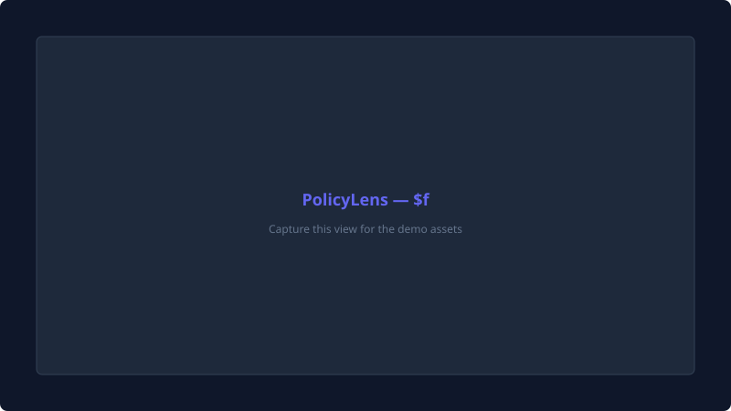
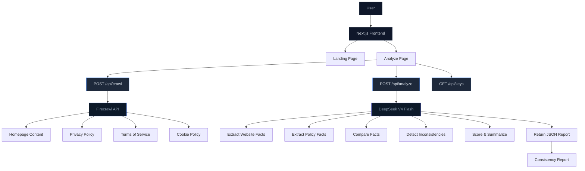
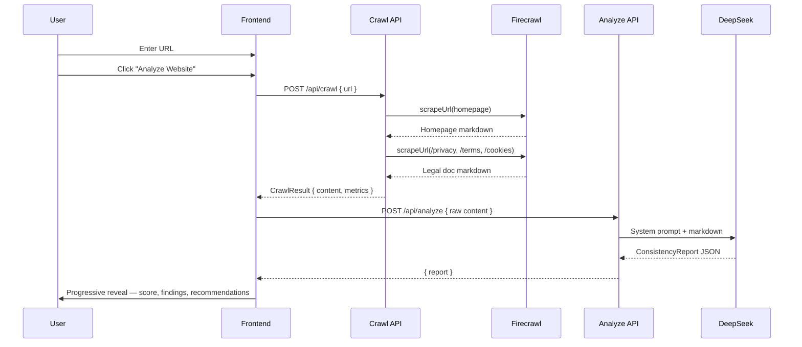

<table>
  <tr>
    <td>
      <picture>
        <source media="(prefers-color-scheme: dark)" srcset="https://img.shields.io/badge/status-production-10b981?style=flat-square">
        
      </picture>
    </td>
    <td>
      <picture>
        <source media="(prefers-color-scheme: dark)" srcset="https://img.shields.io/badge/build-passing-10b981?style=flat-square">
        
      </picture>
    </td>
    <td>
      <picture>
        <source media="(prefers-color-scheme: dark)" srcset="https://img.shields.io/badge/next.js-16-black?style=flat-square&logo=next.js&logoColor=white">
        
      </picture>
    </td>
    <td>
      <picture>
        <source media="(prefers-color-scheme: dark)" srcset="https://img.shields.io/badge/TypeScript-5-3178C6?style=flat-square&logo=typescript">
        
      </picture>
    </td>
    <td>
      <picture>
        <source media="(prefers-color-scheme: dark)" srcset="https://img.shields.io/badge/license-MIT-green?style=flat-square">
        
      </picture>
    </td>
  </tr>
</table>

<br />

<p align="center">
  <picture>
    <source media="(prefers-color-scheme: dark)" srcset="public/demo/hero.svg">
    
  </picture>
</p>

<h1 align="center">PolicyLens</h1>

<p align="center">
  <em>AI-powered website vs. policy documentation analysis.</em><br />
  Detect inconsistencies, missing disclosures, and documentation drift in minutes.
</p>

<p align="center">
  <a href="#features">Features</a> •
  <a href="#how-it-works">How it Works</a> •
  <a href="#architecture">Architecture</a> •
  <a href="#getting-started">Getting Started</a> •
  <a href="#deploy">Deploy</a>
</p>

<br />

---

## The Problem

Companies ship features faster than their legal teams can update documentation. The result?

- **Analytics scripts** run without privacy policy disclosure
- **AI chatbots** collect user data without terms of service updates
- **Payment processors** integrate without policy mention
- **Newsletter signups** process personal data without proper consent language

This "documentation drift" creates legal risk under GDPR, CCPA, and similar regulations. Traditional compliance audits are manual, expensive, and rarely run more than once a quarter.

<br />

## The Solution

**PolicyLens automates this audit.** Enter a URL, and within seconds you get a structured report showing every gap between what a website actually does and what its legal documents say.


<br />

## Key Features

<table>
  <tr>
    <td width="50%">
      <h3>🔍 Real Website Crawling</h3>
      <p>Discovers and crawls privacy policies, terms of service, and cookie policies automatically via Firecrawl. Handles JavaScript-rendered pages.</p>
    </td>
    <td width="50%">
      <h3>🧠 Structured AI Analysis</h3>
      <p>DeepSeek-powered multi-step pipeline extracts facts, compares them against legal documents, and assigns confidence-scored findings.</p>
    </td>
  </tr>
  <tr>
    <td width="50%">
      <h3>📊 Mission Control Dashboard</h3>
      <p>Real-time execution timeline with live metrics. Every crawl step stays visible — nothing disappears.</p>
    </td>
    <td width="50%">
      <h3>📈 Consistency Scoring</h3>
      <p>0–100 score with severity breakdown (Critical / High / Medium / Low). Each finding includes website and policy evidence.</p>
    </td>
  </tr>
  <tr>
    <td width="50%">
      <h3>📋 Professional Reports</h3>
      <p>Progressive reveal with animated score, executive summary, evidence-backed findings, and numbered recommendations.</p>
    </td>
    <td width="50%">
      <h3>📤 Multiple Export Formats</h3>
      <p>Copy to clipboard, download as Markdown, or download as JSON. Integrate findings into your existing workflow.</p>
    </td>
  </tr>
</table>

<br />

## How It Works

### 1. Enter a URL

Paste any public website URL. PolicyLens works with most modern websites including SaaS platforms, e-commerce stores, marketing sites, and documentation portals.

### 2. Watch the Mission Control

The workspace shows a live execution timeline:

```
✓ Homepage Crawled         (2.4s)
✓ Privacy Policy Found     (1.1s)
✓ Terms Found              (0.9s)
✓ Cookie Policy Found      (0.7s)
⏳ Extracting Website Facts  (...)
```

Every step stays visible. Sidebar metrics update in real time — pages crawled, characters processed, tokens consumed, duration elapsed.

### 3. Review the Report

The report reveals itself progressively:

1. **Score** fades in — large typography, number counts up
2. **Summary** slides in — editorial spacing, meta bar
3. **Findings** animate in one-by-one — each with severity, confidence, evidence, and recommendation
4. **Recommendations** appear — numbered, actionable

### 4. Export

Copy the full report, download as Markdown for documentation, or download as JSON for programmatic analysis.

<br />

---

## Screenshots

| Page | Preview | What You'll See |
|------|---------|-----------------|
| **Landing** | `public/demo/hero.svg` | Animated gradient hero, URL input, feature cards, 3-step workflow |
| **Mission Control** | `public/demo/scanner.svg` | Live execution timeline, sidebar metrics, progress bar |
| **Report** | `public/demo/report.svg` | Progressive reveal — score, summary, findings, recommendations |
| **Dashboard** | `public/demo/dashboard.svg` | Analysis pipeline with all stages visible |
| **Mobile** | `public/demo/mobile.svg` | Fully responsive — same experience on any device |

<br />

---

## Architecture

### Application Overview



### Data Flow Sequence



<br />

---

## Tech Stack

| Layer | Choice | Why |
|-------|--------|-----|
| **Framework** | [Next.js 16](https://nextjs.org) (App Router, Turbopack) | Modern React metaframework with server-side API routes, SSR, and excellent developer experience |
| **Language** | [TypeScript 5](https://www.typescriptlang.org) (strict mode) | Type safety, better refactoring, self-documenting code |
| **Styling** | [Tailwind CSS v4](https://tailwindcss.com) + [shadcn/ui](https://ui.shadcn.com) | Utility-first, consistent design system, rapid development |
| **Animations** | [Framer Motion 12](https://motion.dev) | Declarative animation API, staggered children, layout animations |
| **Crawling** | [Firecrawl API v4](https://firecrawl.dev) | Reliable web scraping with markdown output, JS rendering, simple API |
| **AI** | [DeepSeek V4 Flash](https://platform.deepseek.com) | Cost-effective structured reasoning, OpenAI-compatible, 10x cheaper than GPT-4 |
| **Icons** | [Lucide React](https://lucide.dev) | Consistent, lightweight, comprehensive icon set |
| **Typography** | [Geist](https://vercel.com/font) | Vercel's typeface — clean, modern, highly legible at all sizes |
| **Validation** | [Zod](https://zod.dev) | Runtime type validation with declarative schemas |
| **Deployment** | [Vercel](https://vercel.com) | Zero-config Next.js deployment, edge functions, preview deployments |

<br />

---

## Getting Started

### Prerequisites

- [Node.js](https://nodejs.org) 18+ (20 recommended)
- [npm](https://nodejs.org) (or [pnpm](https://pnpm.io))
- API keys for Firecrawl and DeepSeek

### Quick Start

```bash
# 1. Clone the repository
git clone https://github.com/saitarun1999/policylens.git
cd policylens

# 2. Install dependencies
npm install

# 3. Configure environment variables
cp .env.example .env.local
# Edit .env.local with your API keys

# 4. Start development server
npm run dev
# → http://localhost:3000
```

### Environment Variables

```env
# Required — Website Crawling
FIRECRAWL_API_KEY=fc_your_firecrawl_api_key_here

# Required (choose one) — AI Analysis
DEEPSEEK_API_KEY=sk_your_deepseek_api_key_here   # Recommended
# MISTRAL_API_KEY=your_mistral_api_key_here       # Alternative
```

**[Full environment reference →](docs/environment.md)**

> API keys are server-side only. PolicyLens never exposes them to the browser.

<br />

---

## Deploy

### Vercel (One-Click)

[](https://vercel.com/new/clone?repository-url=https%3A%2F%2Fgithub.com%2Fsaitarun1999%2Fpolicylens)

1. Click the button above
2. Import the repository
3. Add `FIRECRAWL_API_KEY` and `DEEPSEEK_API_KEY` environment variables
4. Deploy — zero configuration required

**[Full deployment guide →](docs/deployment.md)**

<br />

---

## Folder Structure

```
policylens/
├── src/
│   ├── app/
│   │   ├── layout.tsx            # Root layout — SEO, fonts, metadata
│   │   ├── page.tsx              # Landing page
│   │   ├── globals.css           # Global styles, animations
│   │   ├── analyze/
│   │   │   ├── page.tsx          # Analyze route (Suspense boundary)
│   │   │   └── client.tsx        # URL validation + orchestration
│   │   └── api/
│   │       ├── crawl/route.ts    # POST /api/crawl — Firecrawl
│   │       ├── analyze/route.ts  # POST /api/analyze — DeepSeek
│   │       └── keys/route.ts     # GET /api/keys — status check
│   ├── components/
│   │   ├── landing/              # Landing page sections
│   │   ├── analyze/              # Mission Control + Report
│   │   └── ui/                   # shadcn/ui primitives
│   └── lib/
│       ├── types.ts              # TypeScript interfaces
│       ├── constants.ts          # Theme, labels, configuration
│       └── utils.ts              # Utility functions
├── docs/                         # Comprehensive documentation
│   ├── architecture.md           # System architecture & diagrams
│   ├── ai-workflow.md            # AI pipeline design
│   ├── api.md                    # API reference
│   ├── deployment.md             # Vercel deployment guide
│   ├── environment.md            # Environment variables reference
│   ├── limitations.md            # Known constraints
│   ├── roadmap.md                # Feature roadmap
│   └── troubleshooting.md        # Common issues & fixes
├── .github/                      # GitHub configuration
├── public/                       # Static assets, screenshots
├── package.json
├── tsconfig.json
├── next.config.ts
└── vercel.json
```

<br />

---

## Project Philosophy

**AI should empower, not replace.**

PolicyLens provides AI-assisted analysis, not legal judgments. Every finding includes confidence scoring, evidence from both the website and the policy, and actionable recommendations. The tool is designed to _accelerate_ human review, not replace it.

**Developer experience matters.**

This repository is engineered to be cloned, configured, and running in under two minutes. The codebase prioritizes readability, maintainability, and strict typing over clever abstractions.

**Privacy-first.**

API keys stay server-side. No user accounts. No persistent storage. Reports exist only in browser state. The application collects no telemetry, analytics, or usage data.

<br />

---

## Limitations

- **Single-page crawl** — Crawls homepage + direct links to /privacy, /terms, /cookies
- **No persistent storage** — Reports are held in browser state only
- **No authentication** — Anyone with the URL can trigger an analysis
- **Dark mode only** — No light mode toggle currently
- **Not legal advice** — PolicyLens is an analysis tool, not a law firm

**[Full limitations →](docs/limitations.md)**

<br />

---

## Roadmap

| Quarter | Focus |
|---------|-------|
| **Q3 2026** | ✅ Core: crawl, analyze, report, documentation |
| **Q4 2026** | Authentication, saved reports, multi-page crawl, PDF export |
| **Q1 2027** | Scheduled monitoring, historical comparisons, team workspaces |
| **Q2 2027** | Multi-language, jurisdiction detection, browser extension |

**[Full roadmap →](docs/roadmap.md)**

<br />

---

## API Reference

| Endpoint | Method | Description |
|----------|--------|-------------|
| `/api/crawl` | POST | Crawl a website via Firecrawl |
| `/api/analyze` | POST | Analyze content via DeepSeek |
| `/api/keys` | GET | Check API key configuration status |

**[Full API documentation →](docs/api.md)**

<br />

---

## Contributing

We welcome contributions! See [CONTRIBUTING.md](CONTRIBUTING.md) for guidelines.

- [Code of Conduct](CODE_OF_CONDUCT.md)
- [Issue Template](.github/ISSUE_TEMPLATE.md)
- [Pull Request Template](.github/PULL_REQUEST_TEMPLATE.md)

<br />

---

## License

MIT © [saitarun1999](https://github.com/saitarun1999)

<br />

---

## FAQ

**Q: Do I need API keys to use PolicyLens?**

Yes. You need a Firecrawl API key for website crawling and a DeepSeek or Mistral API key for AI analysis. Both have free tiers.

**Q: Are my API keys safe?**

Yes. API keys are used exclusively in Next.js API routes and never sent to the browser. They are environment variables on your server.

**Q: Can I use PolicyLens for any website?**

PolicyLens works best with public websites that have privacy policies, terms of service, and/or cookie policies. Sites behind login walls or with heavy JavaScript may have limited results.

**Q: Is PolicyLens a replacement for legal review?**

No. PolicyLens provides AI-assisted analysis to accelerate human review. All findings should be verified by qualified legal professionals.

**Q: Where are my reports stored?**

Reports exist only in your browser's memory. Refreshing the page clears them. PolicyLens does not store or transmit any data.

<br />

---

<p align="center">
  Built with Next.js 16, TypeScript, Tailwind CSS v4, Firecrawl, and DeepSeek.
</p>

<p align="center">
  <a href="https://policylens.app">policylens.app</a> •
  <a href="https://github.com/saitarun1999/policylens">GitHub</a> •
  <a href="https://vercel.com">Deployed on Vercel</a>
</p>
