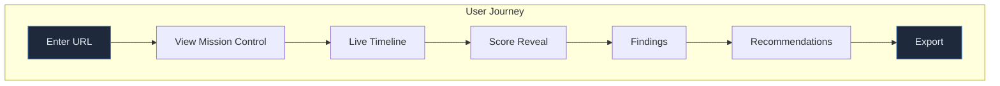
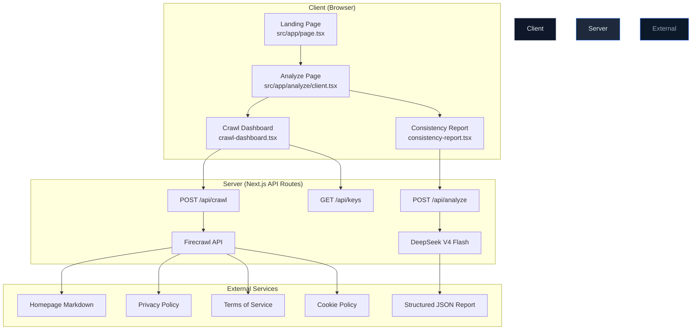
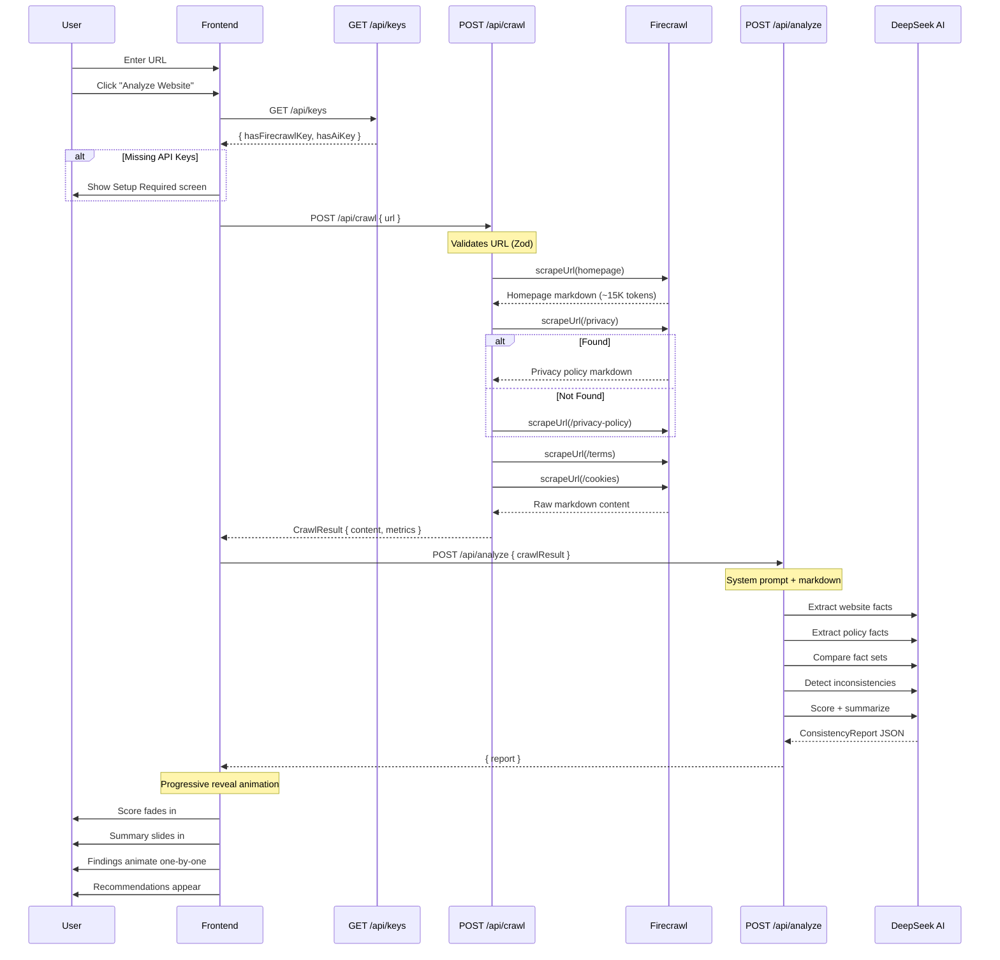
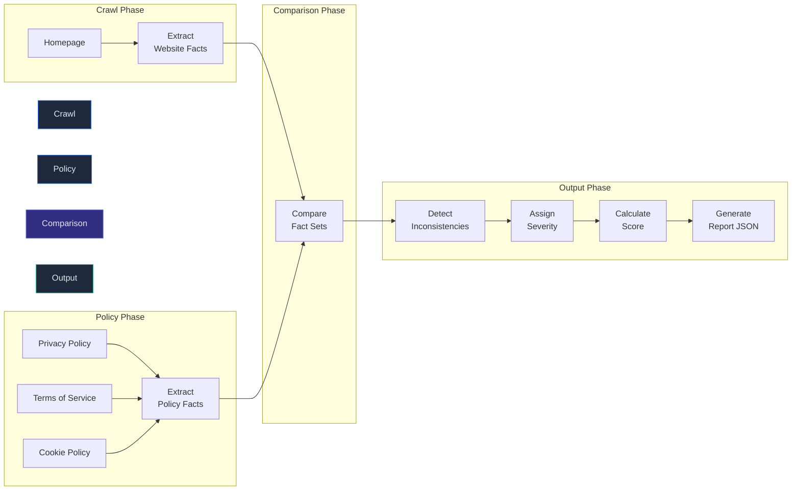
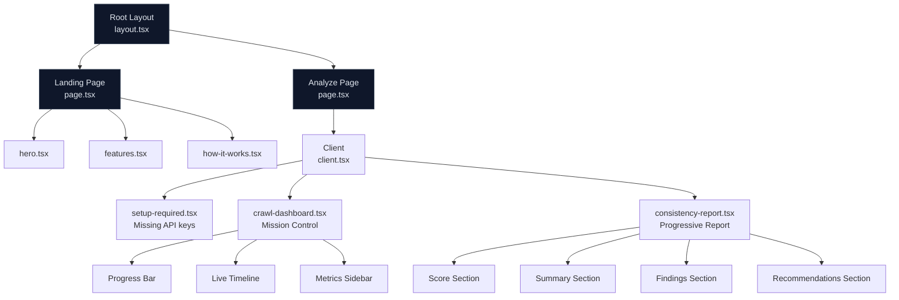
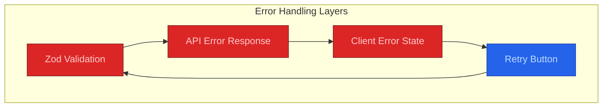

# Architecture

## Overview

PolicyLens is a full-stack Next.js 16 application that crawls websites, extracts structured facts via AI, and produces consistency reports comparing website implementation against legal documentation.

The application follows a **server-centric architecture** — all API keys, AI calls, and crawling logic execute on the server. The client only receives and displays structured data.

---

## User Flow



---

## Application Architecture



---

## Request Lifecycle



---

## Analysis Pipeline



---

## Component Tree



---

## Key Design Decisions

| Decision | Rationale | Tradeoff |
|----------|-----------|----------|
| **Single AI call** vs multi-step | Lower latency, fewer API costs, simpler error handling | Harder to debug intermediate results |
| **Server-side API routes** vs client-side API calls | API keys never exposed to browser, CORS-free | Requires Vercel serverless functions |
| **Firecrawl** vs Puppeteer/Playwright | Markdown output ideal for LLM, handles JS rendering, no infrastructure | External dependency, rate limits |
| **DeepSeek** vs GPT-4 | 10x cheaper for equivalent reasoning, OpenAI-compatible SDK | Less known, fewer integrations |
| **Session-only state** vs database | Zero infrastructure for MVP, no auth complexity | Reports lost on page refresh |
| **Dark mode only** vs theme toggle | Consistent brand experience, faster development | Accessibility limitation |
| **Zod validation** vs manual checks | Runtime type safety, declarative schemas, auto-error messages | Added dependency (~15KB) |
| **Progressive reveal** vs full report render | Better perceived performance, cinematic experience | More complex animation coordination |

---

## Data Flow

### Crawl Data Flow

```
User URL → Zod Validation → Firecrawl API → Markdown Content → Metrics
                                 │
                                 ├── Homepage (~15K tokens)
                                 ├── Privacy Policy (~30K tokens)
                                 ├── Terms of Service (~30K tokens)
                                 └── Cookie Policy (~10K tokens)
```

### Analysis Data Flow

```
Raw Markdown → System Prompt → DeepSeek → Structured JSON
                                                  │
                    ┌──────────────────────────────┤
                    │               │              │
                    ▼               ▼              ▼
            WebsiteFacts    PolicyFacts    Consistencies
                    │               │              │
                    └───────┬───────┘              │
                            ▼                      ▼
                      Comparison           Severity Scoring
                            │                      │
                            └──────────┬───────────┘
                                       ▼
                              ConsistencyReport
```

---

## Error Boundaries

The application implements three layers of error handling:

1. **Component-level** — Each UI section has its own error/empty/loading state
2. **API-level** — Zod validation + try/catch with structured error responses
3. **Route-level** — Next.js error boundaries for unhandled exceptions



---

## Security Model

```
┌─────────────────────────────────────────────────────┐
│                    Browser                            │
│  - Renders UI only                                   │
│  - Never sees API keys                               │
│  - Receives only structured report data              │
└──────────────┬──────────────────────────────────────┘
               │ HTTPS (encrypted)
               ▼
┌─────────────────────────────────────────────────────┐
│               Next.js Server                          │
│  - POST /api/crawl    → Firecrawl (API key here)     │
│  - POST /api/analyze  → DeepSeek (API key here)      │
│  - GET /api/keys      → Boolean check only           │
└──────────────┬──────────────────────────────────────┘
               │ TLS
               ▼
┌─────────────────────────────────────────────────────┐
│            External Services                          │
│  - Firecrawl API                                     │
│  - DeepSeek API                                      │
└─────────────────────────────────────────────────────┘
```

---

## Related Documentation

- [AI Workflow](ai-workflow.md) — Detailed AI pipeline design
- [API Reference](api.md) — Endpoint specifications
- [Deployment](deployment.md) — Vercel deployment guide
- [Environment Variables](environment.md) — Configuration reference
- [Limitations](limitations.md) — Known constraints
- [Troubleshooting](troubleshooting.md) — Common issues
